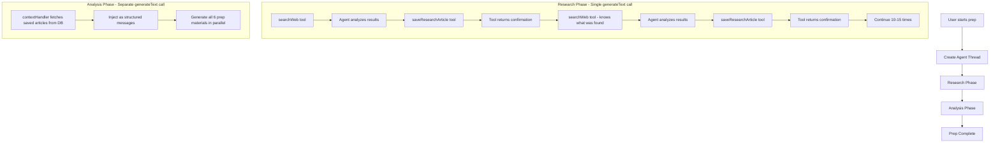

# Agent Incremental Research Refactor

## Problem Statement

Currently, the agent does 5-10+ web searches, accumulates all findings in thread context, then we ask it to extract everything at the end. This creates:

- No incremental progress visibility
- Lost context risk if extraction fails
- Massive thread context with raw search results
- No real-time analysis of article quality
- No ability to build on previous findings

## Solution Architecture

Implement a `saveResearchArticle` tool that lets the agent save and analyze each article immediately after finding it, then use a separate analysis phase that reads saved articles via `contextHandler`.




## Implementation Plan

### 1. Add `researchArticles` Table to Schema

**File:** [`convex/schema.ts`](convex/schema.ts)Add a new table after the existing `research` table (around line 77):

```typescript
researchArticles: defineTable({
  opponentId: v.id("opponents"),
  threadId: v.string(), // Agent thread ID for tracking
  
  // Article metadata
  title: v.string(),
  url: v.string(),
  source: v.string(), // e.g., "nytimes.com"
  publishedDate: v.optional(v.string()),
  
  // Agent analysis (done at save time)
  relevanceScore: v.number(), // 1-10
  category: v.union(
    v.literal("receipt"),
    v.literal("opponent_intel"),
    v.literal("story"),
    v.literal("counter_argument"),
    v.literal("general")
  ),
  keyFinding: v.string(), // The ONE most important fact/quote
  specificEvidence: v.string(), // Exact stat, study name, or quote
  strategicValue: v.string(), // How to deploy in debate
  weaknesses: v.optional(v.string()), // Credibility issues
  
  // Raw content (for later reference)
  content: v.string(), // Full article content
  summary: v.string(), // Agent-generated summary
  
  // Metadata
  savedAt: v.number(),
  searchQuery: v.optional(v.string()), // What search found this
})
  .index("by_opponent", ["opponentId"])
  .index("by_thread", ["threadId"])
  .index("by_opponent_and_category", ["opponentId", "category"])
  .index("by_opponent_and_relevance", ["opponentId", "relevanceScore"]),
```


### 2. Create Research Article Mutations

**File:** [`convex/researchArticles.ts`](convex/researchArticles.ts) (new file)

```typescript
import { internalMutation, internalQuery } from "./_generated/server";
import { v } from "convex/values";

/**
    * Saves a research article with agent analysis.
    * Called by the saveResearchArticle tool during research phase.
 */
export const save = internalMutation({
  args: {
    opponentId: v.id("opponents"),
    threadId: v.string(),
    title: v.string(),
    url: v.string(),
    source: v.string(),
    publishedDate: v.optional(v.string()),
    relevanceScore: v.number(),
    category: v.union(
      v.literal("receipt"),
      v.literal("opponent_intel"),
      v.literal("story"),
      v.literal("counter_argument"),
      v.literal("general")
    ),
    keyFinding: v.string(),
    specificEvidence: v.string(),
    strategicValue: v.string(),
    weaknesses: v.optional(v.string()),
    content: v.string(),
    summary: v.string(),
    searchQuery: v.optional(v.string()),
  },
  returns: v.id("researchArticles"),
  handler: async (ctx, args) => {
    return await ctx.db.insert("researchArticles", {
      ...args,
      savedAt: Date.now(),
    });
  },
});

/**
    * Gets all research articles for an opponent, optionally filtered by category.
 */
export const getByOpponent = internalQuery({
  args: {
    opponentId: v.id("opponents"),
    category: v.optional(v.string()),
    minRelevance: v.optional(v.number()),
  },
  returns: v.array(v.any()),
  handler: async (ctx, args) => {
    let query = ctx.db
      .query("researchArticles")
      .withIndex("by_opponent", (q) => q.eq("opponentId", args.opponentId));
    
    const articles = await query.collect();
    
    // Filter by category and relevance if specified
    return articles.filter(article => {
      if (args.category && article.category !== args.category) return false;
      if (args.minRelevance && article.relevanceScore < args.minRelevance) return false;
      return true;
    });
  },
});

/**
    * Gets count of saved articles for progress tracking.
 */
export const getCount = internalQuery({
  args: { opponentId: v.id("opponents") },
  returns: v.number(),
  handler: async (ctx, args) => {
    const articles = await ctx.db
      .query("researchArticles")
      .withIndex("by_opponent", (q) => q.eq("opponentId", args.opponentId))
      .collect();
    return articles.length;
  },
});
```


### 3. Add `saveResearchArticle` Tool to Agent

**File:** [`convex/agents.ts`](convex/agents.ts)Replace the existing `createPrepAgent` function (lines 18-72) with:

```typescript
export function createPrepAgent(articlesPerSearch: number = 5) {
  return new Agent(components.agent, {
    name: "Debate Prep Strategist",
    languageModel: openrouter.chat("openai/gpt-4o"),
    instructions: `
    You are an expert debate coach and strategist, inspired by Mehdi Hasan's approach to debate preparation.
    Your goal is to help the user prepare for a debate by researching the topic and generating a comprehensive strategy.

    You have access to two tools:
                1. searchWeb - Search for articles and content
                2. saveResearchArticle - Save high-quality articles with analysis

    RESEARCH WORKFLOW:
                1. Use searchWeb to find articles
                2. For EACH useful article, immediately call saveResearchArticle with your analysis
                3. The tool will tell you how many articles you've saved - use this to track progress
                4. Build on previous findings - if you saved a statistic, look for counter-arguments next
    
    QUALITY STANDARDS - Only save articles that have:
                - Specific statistics with dates/sources (not vague claims)
                - Named studies, reports, or expert quotes with credentials
                - Concrete examples or case studies
                - Opponent's past statements or contradictions
                - Strategic debate value
    
    DO NOT save articles that are:
                - Generic opinion pieces without hard data
                - Paywalled or inaccessible content
                - Duplicate information you already found
                - Off-topic or tangentially related
                - Below 6/10 relevance score
    
    Focus your searches on:
                - "Receipts": hard facts, statistics, specific study names, and dates
                - "Opponent Intel": common arguments used by the other side and their weaknesses
                - "Stories": anecdotes or examples for emotional openings
  `,
    tools: {
      searchWeb: createTool({
        description: "Search the web for debate evidence and articles.",
        args: z.object({
          query: z.string().describe("The search query"),
        }),
        handler: async (ctx, args) => {
          const apiKey = process.env.FIRECRAWL_API_KEY;
          if (!apiKey) throw new Error("FIRECRAWL_API_KEY is not set");

          console.log(`🔍 Searching for: "${args.query}"`);

          try {
            const results = await searchAndScrape(args.query, apiKey, articlesPerSearch);
            console.log(`✅ Found ${results.length} results`);

            return results
              .map(
                (r) =>
                  `Title: ${r.title}\nSource: ${r.url}\nPublished: ${r.publishedDate || "Unknown"}\nContent: ${r.content.substring(0, 1500)}...`,
              )
              .join("\n\n");
          } catch (error) {
            console.error(`❌ Search error:`, error);
            throw error;
          }
        },
      }),
      
      saveResearchArticle: createTool({
        description: `Save a research article with your analysis. Only save high-quality articles (6+ relevance).
        
        You MUST analyze each article before saving:
                                - What is the ONE key finding?
                                - What specific evidence does it provide?
                                - How would you deploy this in debate?
                                - What category does it fit?`,
        
        args: z.object({
          title: z.string().describe("Article title"),
          url: z.string().describe("Article URL"),
          source: z.string().describe("Source domain (e.g., 'nytimes.com')"),
          publishedDate: z.string().optional().describe("Publication date if available"),
          relevanceScore: z.number().min(1).max(10).describe("Relevance to debate (1-10). Must be 6+ to save."),
          category: z.enum(["receipt", "opponent_intel", "story", "counter_argument", "general"])
            .describe("receipt=hard data/stats, opponent_intel=their arguments/weaknesses, story=emotional examples, counter_argument=rebuttals, general=background"),
          keyFinding: z.string().describe("The ONE most important fact, quote, or insight from this article"),
          specificEvidence: z.string().describe("Exact statistic, study name, expert quote with credentials, or specific fact"),
          strategicValue: z.string().describe("How to deploy this evidence in the debate - be specific"),
          weaknesses: z.string().optional().describe("Any credibility issues, limitations, or potential counterarguments to this source"),
          content: z.string().describe("Full article content (what you received from searchWeb)"),
          summary: z.string().describe("2-3 sentence summary of the article's main points"),
          searchQuery: z.string().optional().describe("The search query that found this article"),
        }),
        
        handler: async (ctx, args): Promise<string> => {
          // Type assertion for custom context fields
          const typedCtx = ctx as typeof ctx & { opponentId?: string; threadId: string };
          
          // Reject low-quality articles
          if (args.relevanceScore < 6) {
            return `❌ REJECTED: "${args.title}" (relevance: ${args.relevanceScore}/10)
            
Reason: Score too low. Only save articles with 6+ relevance that provide specific, actionable debate material.

Continue searching for better sources.`;
          }
          
          // Save to database
          await ctx.runMutation(internal.researchArticles.save, {
            opponentId: typedCtx.opponentId as any, // Will be set by action context
            threadId: typedCtx.threadId,
            title: args.title,
            url: args.url,
            source: args.source,
            publishedDate: args.publishedDate,
            relevanceScore: args.relevanceScore,
            category: args.category,
            keyFinding: args.keyFinding,
            specificEvidence: args.specificEvidence,
            strategicValue: args.strategicValue,
            weaknesses: args.weaknesses,
            content: args.content,
            summary: args.summary,
            searchQuery: args.searchQuery,
          });
          
          // Get current count for progress tracking
          const count = await ctx.runQuery(internal.researchArticles.getCount, {
            opponentId: typedCtx.opponentId as any,
          });
          
          return `✅ SAVED: "${args.title}" (${args.relevanceScore}/10)
Category: ${args.category}
Key Finding: ${args.keyFinding}

Progress: ${count} articles saved so far.

Continue researching. Look for different types of evidence to build a comprehensive case.`;
        },
      }),
    },
  });
}
```


### 4. Refactor Research Phase in prep.ts

**File:** [`convex/actions/prep.ts`](convex/actions/prep.ts)Replace the research and extraction phases (lines 126-198) with:

```typescript
// Build research prompt with intensity-specific instructions
const intensityInstructions = getResearchInstructions(researchIntensity);
console.log(
  `[generateStrategy] Intensity instructions for ${researchIntensity}:`,
  intensityInstructions
);

const researchPrompt = `
  ${strategicBrief}

  ${intensityInstructions}

  We are in the year 2026.
  ${opponent.opponentPastStatements ? `Also look for information about statements made by or about this opponent: ${opponent.opponentPastStatements}` : ""}
  ${opponent.userResearch ? `The debater has provided this research context to consider: ${opponent.userResearch.substring(0, 1000)}...` : ""}
  
  IMPORTANT: Use the saveResearchArticle tool to save each valuable article you find.
  The tool will track your progress and help you build on previous findings.
`;

console.log(
  `[generateStrategy] Full research prompt being sent to agent:`,
  researchPrompt.substring(0, 500) + "..."
);

try {
  console.log("[generateStrategy] Starting research phase");
  
  // Pass opponentId in context so tools can access it
  await thread.generateText(
    { 
      prompt: researchPrompt,
      maxSteps: 30, // Allow many search + save cycles
      storageOptions: {
        saveMessages: "promptAndOutput" // Don't save all tool calls to thread
      }
    }
  );
  
  console.log("[generateStrategy] Research phase complete");
} catch (error) {
  console.error("[generateStrategy] Research phase failed:", error);
  await updateProgress("error", `Research phase failed: ${error}`);
  throw new Error(`Research phase failed: ${error}`);
}

// Get saved articles for legacy research table compatibility
const savedArticles = await ctx.runQuery(internal.researchArticles.getByOpponent, {
  opponentId: args.opponentId,
});

// Convert to legacy format for existing code
const research = savedArticles.map(article => ({
  title: article.title,
  source: article.source,
  content: article.content,
  summary: article.summary,
  url: article.url,
  publishedDate: article.publishedDate,
}));

console.log(
  "[generateStrategy] Retrieved",
  research.length,
  "saved research articles",
);
```


### 5. Update Analysis Phase with contextHandler

**File:** [`convex/actions/prep.ts`](convex/actions/prep.ts)Modify the research synthesis generation (around line 205) to use saved articles with contextHandler:

```typescript
// 3. Generate Research Synthesis with saved articles as context
await updateProgress("synthesizing");
let researchSynthesis;
try {
  console.log("[generateStrategy] Generating research synthesis");
  researchSynthesis = await ctx.runAction(
    internal.actions.prepGeneration.generateResearchSynthesis,
    {
      opponentId: args.opponentId,
      userId: opponent.userId,
      topic: args.topic,
      position: args.position,
      research, // Legacy format for compatibility
      strategicBrief
    },
  );
  console.log("[generateStrategy] Research synthesis complete");
} catch (error) {
  console.error("[generateStrategy] Research synthesis failed:", error);
  researchSynthesis = null;
}
```


### 6. Update Thread Creation to Pass Context

**File:** [`convex/actions/prep.ts`](convex/actions/prep.ts)Modify thread creation (around line 116) to pass opponentId in context:

```typescript
// Create agent with user's articlesPerSearch setting
let thread;
try {
  const agent = createPrepAgent(articlesPerSearch);
  const result = await agent.createThread(ctx);
  thread = result.thread;
  
  // Store threadId for tool access
  const threadId = result.threadId;
  
  console.log("[generateStrategy] Thread created:", threadId);
} catch (error) {
  console.error("[generateStrategy] Failed to create thread:", error);
  await updateProgress("error", `Failed to create prep agent: ${error}`);
  throw new Error(`Failed to create prep agent thread: ${error}`);
}
```

Then update the generateText call to pass opponentId:

```typescript
// Create context with opponentId for tools
const toolContext = { ...ctx, opponentId: args.opponentId };

await thread.generateText(
  toolContext, // Pass extended context
  { 
    prompt: researchPrompt,
    maxSteps: 30,
    storageOptions: {
      saveMessages: "promptAndOutput"
    }
  }
);
```


### 7. Add Progress Tracking for Saved Articles

**File:** [`convex/prepProgress.ts`](convex/prepProgress.ts)Add a field to track article count in the progress updates:

```typescript
// In updateProgress mutation, add:
articlesFound: v.optional(v.number()),
```

Then update the progress during research:

```typescript
// After research phase in prep.ts:
const articleCount = await ctx.runQuery(internal.researchArticles.getCount, {
  opponentId: args.opponentId,
});

await ctx.runMutation(internal.prepProgress.updateProgress, {
  opponentId: args.opponentId,
  status: "extracting",
  message: `Found ${articleCount} research articles`,
});
```


## Key Benefits

1. **Incremental Progress**: User sees articles being saved in real-time
2. **No Lost Work**: Each article is saved immediately, survives failures
3. **Real-Time Quality Control**: Agent analyzes relevance before saving
4. **Smaller Thread Context**: Raw search results don't accumulate in thread
5. **Iterative Research**: Agent can build on previous findings
6. **Better Analysis**: Structured data enables richer synthesis

## Migration Notes

- Existing `research` table remains for backward compatibility
- New `researchArticles` table provides richer structure
- Both tables are populated during prep generation
- No changes needed to existing UI components initially
- Can gradually migrate UI to use `researchArticles` for better displays

## Testing Strategy

1. Test with basic research intensity (3-5 searches)