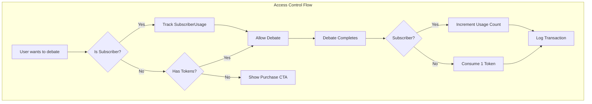

# Token Economy Monetization System

## Architecture Overview

The token system implements per-scenario wallets where users have separate token balances for each scenario type. This enables targeted marketing funnels where users receive tokens for specific scenarios they discovered through ads.




## Phase 1: Schema and Constants

### New Database Tables in [`convex/schema.ts`](convex/schema.ts)

Add 5 new tables after existing tables:

1. **scenarioTokens** - Per-scenario token wallets

- `userId`, `scenarioId`, `balance`
- Indexes: `by_user`, `by_user_scenario`

2. **tokenTransactions** - Audit ledger for all token movements

- `userId`, `scenarioId`, `amount`, `reason`, `metadata`, `createdAt`
- Reasons: `funnel_grant`, `purchase`, `debate_complete`, `admin_grant`, `refund`

3. **subscriberUsage** - Monthly tracking for subscribers (hidden cap)

- `userId`, `periodStart`, `periodEnd`, `debateCount`, `notifiedOwner`

4. **pendingGrants** - Marketing funnel grant links

- `grantToken`, `scenarioId`, `tokenAmount`, `claimed`, `claimedBy`, `expiresAt`, `utmSource`, `utmCampaign`

5. **subscriptions** - Basic subscription status (needed for subscriber checks)

- `userId`, `status`, `customerId`, `currentPeriodStart`, `currentPeriodEnd`

### Constants File: [`convex/lib/monetization.ts`](convex/lib/monetization.ts) (new)

```typescript
export const SUBSCRIBER_MONTHLY_CAP = 100;
export const FUNNEL_GRANT_AMOUNT = 10;
export const OPPONENT_CREATION_BUFFER = 2;
export const GRANT_EXPIRATION_MS = 30 * 24 * 60 * 60 * 1000; // 30 days
export const OWNER_EMAIL = "konrad@oratorprep.com";
export const TOKEN_PACKS = [
  { tokens: 10, priceUsd: 1000 },
  { tokens: 20, priceUsd: 2000 },
  { tokens: 30, priceUsd: 3000 },
] as const;
```

---

## Phase 2: Token Operations

### New File: [`convex/tokens.ts`](convex/tokens.ts)

**Public Queries:**

- `getBalance({ scenarioId })` - Get token balance for specific scenario
- `getAllBalances()` - Get all balances for current user (returns `Record<scenarioId, balance>`)
- `checkAccess({ scenarioId })` - Returns `{ hasAccess, reason, balance? }`
- `canCreateOpponent({ scenarioId })` - Anti-abuse check for opponent creation

**Internal Mutations:**

- `INTERNAL_grantTokens({ userId, scenarioId, amount, reason, metadata })` - Add tokens
- `INTERNAL_consumeToken({ userId, scenarioId, debateId })` - Consume on debate end

**Helper Functions:**

- `trackSubscriberUsage(ctx, userId)` - Track monthly usage, notify on cap
- `getMonthStart(timestamp)` / `getMonthEnd(timestamp)` - Billing period helpers

---

## Phase 3: Access Control Integration

### Modify [`convex/opponents.ts`](convex/opponents.ts)

Add anti-abuse check in `create` mutation:

- Before inserting, call `canCreateOpponent` query
- Block if `incompleteOpponents >= tokens + OPPONENT_CREATION_BUFFER`
- Subscribers bypass this check

### Modify [`convex/debates.ts`](convex/debates.ts)

Add access check in `create` mutation:

- Before creating debate, call `checkAccess` query
- Throw error if `!hasAccess` with reason

---

## Phase 4: Debate End Hook (Token Consumption)

### Modify [`convex/http.ts`](convex/http.ts)

In the `end-of-call-report` handler, after marking debate complete:

```typescript
// Get debate and opponent to determine scenarioType
const debate = await ctx.runQuery(internal.debates.getInternal, { debateId });
if (debate?.opponentId) {
  const opponent = await ctx.runQuery(internal.opponents.getInternal, { opponentId: debate.opponentId });
  if (opponent?.scenarioType) {
    await ctx.runMutation(internal.tokens.INTERNAL_consumeToken, {
      userId: debate.userId,
      scenarioId: opponent.scenarioType,
      debateId,
    });
  }
}
```

---

## Phase 5: Marketing Funnel System

### Add to [`convex/tokens.ts`](convex/tokens.ts)

**Mutations:**

- `createGrantLink({ scenarioId, tokenAmount?, utmSource?, utmCampaign? })` - Admin creates grant URL
- `claimGrant({ grantToken })` - User claims tokens after signup

**Queries:**

- `checkGrantToken({ grantToken })` - Validate grant before login (for UI messaging)

### New Route: [`src/routes/claim.$token.tsx`](src/routes/claim.$token.tsx)

Marketing funnel landing page:

1. Check if grant token is valid
2. If not logged in: show signup CTA with scenario-specific messaging, store token in sessionStorage
3. If logged in: auto-claim grant, redirect to opponent-profile with scenario param

### Modify [`src/routes/_app/_auth/onboarding/_layout.username.tsx`](src/routes/_app/_auth/onboarding/_layout.username.tsx)

After onboarding completion:

1. Check sessionStorage for `pendingGrantToken`
2. If exists, claim grant and redirect to scenario's opponent-profile

---

## Phase 6: UI Integration

### New Component: [`src/components/TokenBalance.tsx`](src/components/TokenBalance.tsx)

Display component showing:

- Subscribers: "Unlimited" badge
- Token users: "{balance} tokens remaining"
- Zero tokens: "0 tokens - Purchase tokens" (link placeholder until Stripe)

### Modify [`src/routes/_app/_auth/dashboard/opponent-profile.tsx`](src/routes/_app/_auth/dashboard/opponent-profile.tsx)

Add scenario gating in ScenarioSelector:

- Query `getAllBalances()` and subscription status
- For each scenario option:
- Subscriber: enabled, show "Unlimited"
- Has tokens: enabled, show "{n} tokens"
- No tokens: disabled, grayed out, show "No tokens"

### Add Token Balance to Dashboard Header

Display current scenario's token balance or "Unlimited" for subscribers.---

## Files Changed Summary

| File | Action | Purpose ||------|--------|---------|| `convex/schema.ts` | Modify | Add 5 new tables || `convex/lib/monetization.ts` | Create | Constants and config || `convex/tokens.ts` | Create | All token operations || `convex/http.ts` | Modify | Add token consumption hook || `convex/opponents.ts` | Modify | Add anti-abuse check || `convex/debates.ts` | Modify | Add access check || `src/routes/claim.$token.tsx` | Create | Marketing funnel claim route || `src/components/TokenBalance.tsx` | Create | Balance display component || `src/routes/_app/_auth/dashboard/opponent-profile.tsx` | Modify | Scenario gating UI || `src/routes/_app/_auth/onboarding/_layout.username.tsx` | Modify | Post-signup grant claim |---

## Testing Checklist

After implementation, manually verify:

1. Create user - verify no tokens exist
2. Admin grant tokens via Convex dashboard - verify balance appears
3. Try to create opponent without tokens - should fail with helpful error
4. Grant tokens, create opponent - should succeed
5. Start and complete debate - verify token consumed (balance decreases by 1)
6. Create grant link - visit as logged-out user - see claim UI
7. Sign up via grant link - verify tokens granted after onboarding
8. Scenario selector shows correct access state for each scenario

---

## Deferred to Stripe Phase

- `createTokenCheckout` action (Stripe checkout sessions)