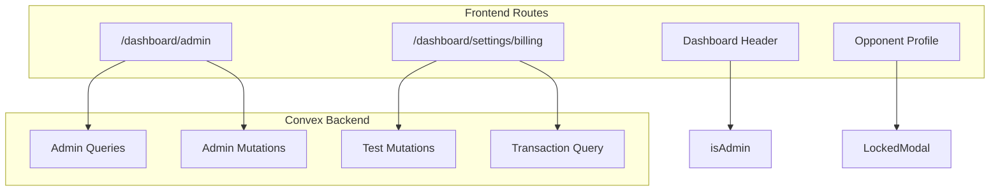

# Token Management & Subscription UI

## Architecture Overview



---

## Phase 1: Schema & Backend

### 1.1 Schema Update

Add `isAdmin` field to users table in [`convex/schema.ts`](convex/schema.ts):

```typescript
users: defineTable({
  // ... existing fields
  isAdmin: v.optional(v.boolean()),
})
```


### 1.2 New Admin Functions in [`convex/tokens.ts`](convex/tokens.ts)

**Public Queries (admin-gated)**:

- `getAllGrantLinks` - List all pending grants with claim counts
- `getGrantLinkStats` - Get detailed stats for a specific grant link

**Public Query (all users)**:

- `getTransactionHistory` - Paginated transaction history (20 per page)

**Internal Mutations**:

- `INTERNAL_deactivateGrant` - Mark grant as expired/deactivated

### 1.3 New Test Mutations in [`convex/tokens.ts`](convex/tokens.ts)

- `testGrantTokens` - Grant tokens to current user (for testing)
- `testCreateSubscription` - Create active subscription for current user
- `testCancelSubscription` - Cancel subscription for current user

---

## Phase 2: Settings Sidebar & Billing Route

### 2.1 Update Settings Layout

Modify [`src/routes/_app/_auth/dashboard/_layout.settings.tsx`](src/routes/_app/_auth/dashboard/_layout.settings.tsx):

- Add "Billing" tab alongside "General"
- Use consistent styling with primary color palette

### 2.2 Create Billing Page

New file: `src/routes/_app/_auth/dashboard/_layout.settings.billing.tsx`**Sections**:

1. **Subscription Status Card**

- Active: Shows plan details, period dates, "Manage" button, test cancel button
- Inactive: Shows upgrade CTA with pricing ($20/mo, $200/yr - 2 months free), test subscribe button

2. **Token Balances Grid**

- Card per scenario with balance and "Buy More" button
- Uses `SCENARIOS` registry for dynamic scenario list

3. **Purchase Tokens**

- Scenario selector dropdown
- 3 pack options: 5 ($10), 15 ($25, "Popular"), 50 ($70, "Best Value")
- Test grant buttons visible to all users

4. **Transaction History**

- Paginated list (20 items)
- Shows: time, scenario, amount (+/-), reason
- Color coding: green for credits, red for debits

---

## Phase 3: Admin Panel

### 3.1 Create Admin Route

New file: `src/routes/_app/_auth/dashboard/_layout.admin.tsx`**Access Control**: Query `getCurrentUser`, check `isAdmin` field. Redirect if not admin.**Sections**:

1. **Quick Stats Header**

- Active links count
- Total claims count

2. **Create Grant Link Form**

- Scenario dropdown (from `SCENARIOS`)
- Token amount input (default 10)
- Expiration: 30 days / 60 days / Never
- UTM Source & Campaign inputs
- Generate button → modal with URL, copy button

3. **Active Grant Links Table**

- Columns: Token (truncated), Scenario, Amount, Created, Expires, Claims, Actions
- Actions: Copy link, View stats
- Stats modal: full details, list of claimers

4. **Manual Token Grant**

- User email input (lookup by email)
- Scenario dropdown
- Amount input
- Reason selector (Admin Grant / Refund / Test)

---

## Phase 4: Header & Enhancements

### 4.1 Update Dashboard Header

Modify [`src/ui/dashboard-header.tsx`](src/ui/dashboard-header.tsx):

- Add "Admin" link between "Settings" and user menu
- Only render if `user.isAdmin === true`

### 4.2 Locked Scenario Modal

Modify [`src/routes/_app/_auth/dashboard/opponent-profile.tsx`](src/routes/_app/_auth/dashboard/opponent-profile.tsx):

- When clicking disabled scenario in popover, show modal:
- "You need tokens to practice this scenario"
- "Buy Tokens" button → navigate to billing
- "Upgrade to Pro" button → navigate to billing

---

## Key Files

| File | Action ||------|--------|| `convex/schema.ts` | Add `isAdmin` field || `convex/tokens.ts` | Add admin queries, test mutations, transaction history || `src/routes/_app/_auth/dashboard/_layout.settings.tsx` | Add Billing tab || `src/routes/_app/_auth/dashboard/_layout.settings.billing.tsx` | NEW - Full billing page || `src/routes/_app/_auth/dashboard/_layout.admin.tsx` | NEW - Admin panel || `src/ui/dashboard-header.tsx` | Add Admin link || `src/routes/_app/_auth/dashboard/opponent-profile.tsx` | Add locked modal |---

## Pricing Constants

Add to [`convex/lib/monetization.ts`](convex/lib/monetization.ts):

```typescript
export const SUBSCRIPTION_MONTHLY_PRICE = 20;
export const SUBSCRIPTION_ANNUAL_PRICE = 200; // 2 months free


```