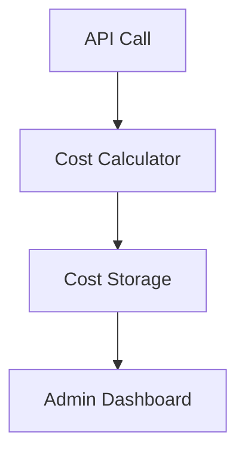

# Design Document

## Overview

The Cost Monitoring system tracks every API call and its cost to understand unit economics. When you make calls to OpenRouter, Vapi, Firecrawl, or Gemini, the system records the cost so you can see if debates/prep/research are profitable vs. token revenue.

## Architecture

Simple approach: intercept API calls, calculate costs, store in database.



## Components and Interfaces

### Cost Calculator
Calculates costs based on usage and known pricing:
- **OpenRouter**: `response.usage.total_tokens * model_price_per_1k_tokens`
- **Vapi**: `call_duration_seconds * price_per_minute / 60`
- **Firecrawl**: `requests_made * price_per_request`
- **Gemini**: `api_calls * estimated_price_per_call`

### Cost Storage
Simple table to store all API costs:
```typescript
// Add to existing schema.ts
apiCosts: defineTable({
  service: v.union(v.literal("openrouter"), v.literal("vapi"), v.literal("firecrawl"), v.literal("gemini")),
  cost: v.number(), // USD cents
  debateId: v.optional(v.id("debates")),
  opponentId: v.optional(v.id("opponents")), // for prep/research costs
  userId: v.id("users"),
  details: v.object({
    // OpenRouter
    model: v.optional(v.string()),
    inputTokens: v.optional(v.number()),
    outputTokens: v.optional(v.number()),
    // Vapi
    duration: v.optional(v.number()),
    // Firecrawl
    requests: v.optional(v.number()),
    // Gemini
    apiCalls: v.optional(v.number()),
  }),
  timestamp: v.number(),
}).index("by_debate", ["debateId"])
  .index("by_opponent", ["opponentId"])
  .index("by_user", ["userId"])
```

### Admin Dashboard
Simple queries to show:
- Total costs per service
- Cost per debate (sum all API calls during that debate)
- Most expensive users/debates
- Daily/weekly totals

## Data Models

### API Cost Entry
```typescript
interface ApiCostEntry {
  service: "openrouter" | "vapi" | "firecrawl" | "gemini";
  cost: number; // USD cents
  debateId?: string; // if during a debate
  opponentId?: string; // if during prep/research
  userId: string;
  details: {
    model?: string;
    inputTokens?: number;
    outputTokens?: number;
    duration?: number;
    requests?: number;
    apiCalls?: number;
  };
  timestamp: number;
}
```

## Implementation Approach

1. **Wrap existing API calls** - modify `callOpenRouter`, Vapi webhook, etc. to record costs
2. **Use known pricing** - hardcode current API prices (update as needed)
3. **Simple cost calculation** - tokens × price, duration × price, etc.
4. **Store everything** - every API call gets a cost record
5. **Basic admin queries** - sum costs by debate, user, service, time period

## Correctness Properties

*A property is a characteristic or behavior that should hold true across all valid executions of a system-essentially, a formal statement about what the system should do. Properties serve as the bridge between human-readable specifications and machine-verifiable correctness guarantees.*

### Property 1: Complete Cost Recording
*For any* API call made to external services, the system should record a cost entry with correct service identification, timestamp, and cost calculation.
**Validates: Requirements 1.1, 1.2, 1.3**

### Property 2: Debate Cost Aggregation
*For any* completed debate session, the total debate cost should equal the sum of all individual API costs recorded during that debate session.
**Validates: Requirements 2.1, 2.2**

### Property 3: Service Cost Totals
*For any* API service, the total spending for that service should equal the sum of all individual cost entries attributed to that service.
**Validates: Requirements 1.4, 3.1**

### Property 4: Average Cost Calculation
*For any* set of debates, the average cost per debate should equal the total costs divided by the number of debates.
**Validates: Requirements 3.2**

### Property 5: Time-based Cost Aggregation
*For any* time period (daily, weekly, monthly), the period total should equal the sum of all costs recorded within that time range.
**Validates: Requirements 3.3**

### Property 6: Most Expensive Service Identification
*For any* set of API services with recorded costs, the service identified as "most expensive" should have the highest total cost among all services.
**Validates: Requirements 3.4**

## Error Handling

- **API Call Failures**: Cost recording failures should not block the original API call
- **Invalid Cost Data**: Negative or extremely large costs should be flagged for review
- **Missing Debate Context**: API calls without debate context should still be recorded with null debateId
- **Service Identification**: Unknown services should be logged but not cause system failures

## Testing Strategy

### Unit Tests
- Test cost calculation for each API service
- Test cost entry creation and validation
- Test aggregation logic for debate sessions
- Test error handling for invalid cost data

### Property-Based Tests
- Generate random API call scenarios and verify cost recording
- Test cost aggregation across multiple debate sessions
- Verify service attribution across different API endpoints
- Test cost dashboard calculations with random cost data

Each property test should run minimum 100 iterations and be tagged with:
**Feature: cost-monitoring-control, Property {number}: {property_text}**