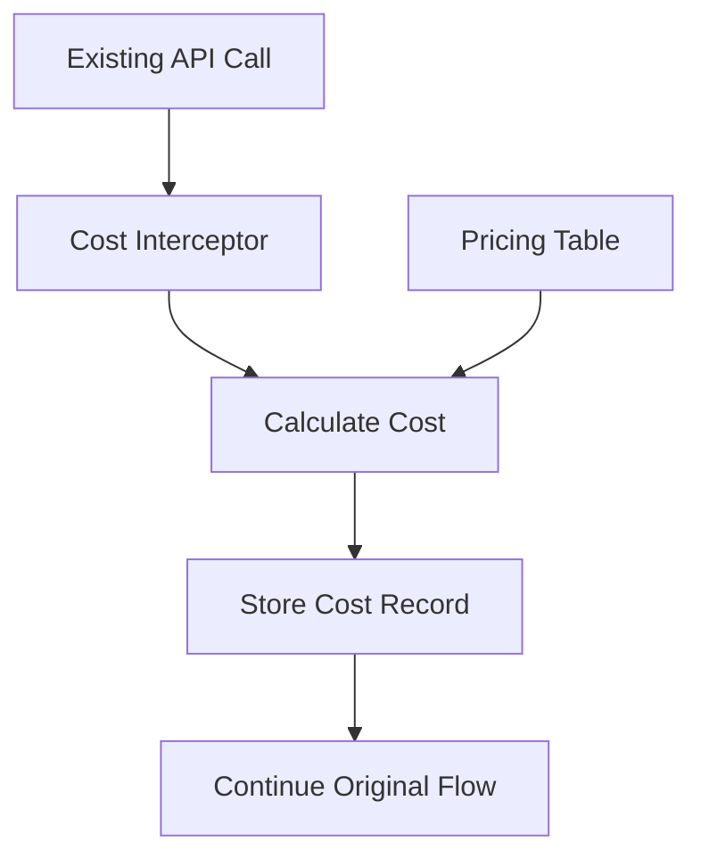

# Design Document

## Overview

The Cost Monitoring system tracks every API call and its cost by intercepting existing API calls, calculating costs using a pricing table, and storing cost records. This enables unit economics analysis - comparing actual API costs to token revenue.

## Architecture

Simple interception approach: wrap existing API functions to record costs after each call.



## Components and Interfaces

### Cost Interceptor
Wraps existing API functions to capture usage and calculate costs:
- **OpenRouter**: Modify `callOpenRouter()` in `convex/lib/openrouter.ts`
- **Vapi**: Modify webhook handler in `convex/http.ts` 
- **Firecrawl**: Modify `searchAndScrape()` in `convex/lib/firecrawl.ts`
- **Gemini**: Modify functions in `convex/lib/geminiDeepResearch.ts`

### Pricing Table
Hardcoded pricing data (updated manually as needed):
```typescript
// convex/lib/apiPricing.ts
export const API_PRICING = {
  openrouter: {
    "anthropic/claude-sonnet-4.5": {
      inputPrice: 3.00,  // USD per 1M tokens
      outputPrice: 15.00, // USD per 1M tokens
    },
    "openai/gpt-4o": {
      inputPrice: 2.50,
      outputPrice: 10.00,
    },
    // ... more models
  },
  vapi: {
    perMinute: 0.05, // USD per minute
  },
  firecrawl: {
    perRequest: 0.003, // USD per request
  },
  gemini: {
    perCall: 0.01, // USD per API call (estimated)
  },
} as const;
```

### Cost Storage
Add new table to existing schema:
```typescript
// Add to convex/schema.ts
apiCosts: defineTable({
  service: v.union(
    v.literal("openrouter"), 
    v.literal("vapi"), 
    v.literal("firecrawl"), 
    v.literal("gemini")
  ),
  cost: v.number(), // USD cents
  debateId: v.optional(v.id("debates")),
  opponentId: v.optional(v.id("opponents")), // for prep/research
  userId: v.id("users"),
  details: v.object({
    // OpenRouter
    model: v.optional(v.string()),
    inputTokens: v.optional(v.number()),
    outputTokens: v.optional(v.number()),
    // Vapi  
    duration: v.optional(v.number()), // seconds
    // Firecrawl
    requests: v.optional(v.number()),
    // Gemini
    apiCalls: v.optional(v.number()),
  }),
  timestamp: v.number(),
})
.index("by_debate", ["debateId"])
.index("by_opponent", ["opponentId"])
.index("by_user", ["userId"])
.index("by_service", ["service"])
```

### Cost Calculator
Helper functions to calculate costs from usage:
```typescript
// convex/lib/costCalculator.ts
export function calculateOpenRouterCost(
  model: string, 
  inputTokens: number, 
  outputTokens: number
): number {
  const pricing = API_PRICING.openrouter[model];
  if (!pricing) return 0;
  
  const inputCost = (inputTokens / 1_000_000) * pricing.inputPrice;
  const outputCost = (outputTokens / 1_000_000) * pricing.outputPrice;
  
  return Math.round((inputCost + outputCost) * 100); // Convert to cents
}

export function calculateVapiCost(durationSeconds: number): number {
  const minutes = durationSeconds / 60;
  const cost = minutes * API_PRICING.vapi.perMinute;
  return Math.round(cost * 100); // Convert to cents
}

// ... similar functions for Firecrawl, Gemini
```

### Admin Queries
Simple queries for cost analysis:
```typescript
// convex/costs.ts
export const getTotalCostsByService = query({
  // Returns total costs grouped by service
});

export const getDebateCosts = query({
  // Returns all costs for a specific debate
});

export const getMostExpensiveDebates = query({
  // Returns debates sorted by total cost
});

export const getDailyCosts = query({
  // Returns costs grouped by day
});
```

## Data Models

### API Cost Entry
```typescript
interface ApiCostEntry {
  service: "openrouter" | "vapi" | "firecrawl" | "gemini";
  cost: number; // USD cents
  debateId?: string;
  opponentId?: string; 
  userId: string;
  details: {
    model?: string;
    inputTokens?: number;
    outputTokens?: number;
    duration?: number;
    requests?: number;
    apiCalls?: number;
  };
  timestamp: number;
}
```

## Implementation Approach

### Phase 1: Research API Pricing
- Research current OpenRouter model pricing
- Research current Vapi pricing structure  
- Research current Firecrawl pricing
- Research current Gemini API pricing
- Create accurate pricing table

### Phase 2: Add Cost Storage
- Add `apiCosts` table to schema
- Create cost calculation helper functions
- Create basic admin queries

### Phase 3: Intercept API Calls
- Modify `callOpenRouter()` to record costs
- Modify Vapi webhook to record call costs
- Modify Firecrawl functions to record costs
- Modify Gemini functions to record costs

### Phase 4: Admin Dashboard
- Create simple admin page to view costs
- Show costs per debate, user, service
- Show daily/weekly totals

## Correctness Properties

*A property is a characteristic or behavior that should hold true across all valid executions of a system-essentially, a formal statement about what the system should do. Properties serve as the bridge between human-readable specifications and machine-verifiable correctness guarantees.*

### Property 1: Complete Cost Recording
*For any* API call made to external services, the system should record a cost entry with correct service identification and cost calculation.
**Validates: Requirements 1.1, 1.2, 1.3, 1.4**

### Property 2: Debate Cost Aggregation  
*For any* completed debate, the total debate cost should equal the sum of all API costs recorded during that debate session.
**Validates: Requirements 2.1, 2.2, 2.3**

### Property 3: Prep Cost Tracking
*For any* prep generation, the total prep cost should equal the sum of all OpenRouter and Firecrawl costs during that generation.
**Validates: Requirements 3.1, 3.2, 3.3**

### Property 4: Cost Summary Accuracy
*For any* time period, the daily/weekly cost totals should equal the sum of all individual cost entries within that period.
**Validates: Requirements 4.1, 4.2, 4.3, 4.4**

## Error Handling

- **API Call Failures**: Cost recording failures should not break the original API call
- **Missing Pricing**: Unknown models/services should log warnings but not crash
- **Invalid Usage Data**: Negative or missing token counts should default to 0 cost
- **Calculation Errors**: Cost calculation failures should log errors and record 0 cost

## Testing Strategy

### Unit Tests
- Test cost calculation functions with known inputs
- Test cost recording with mock API responses
- Test cost aggregation queries
- Test error handling for invalid data

### Property-Based Tests
- Generate random API usage scenarios and verify cost recording
- Test cost aggregation across multiple debates/prep sessions
- Verify service attribution across different API calls
- Test time-based cost summaries with random date ranges

Each property test should run minimum 100 iterations and be tagged with:
**Feature: cost-monitoring-control, Property {number}: {property_text}**

## Correctness Properties

*A property is a characteristic or behavior that should hold true across all valid executions of a system-essentially, a formal statement about what the system should do. Properties serve as the bridge between human-readable specifications and machine-verifiable correctness guarantees.*

### Property 1: Complete Cost Recording
*For any* API call made to external services, the system should record a cost entry with correct service identification, timestamp, and cost calculation.
**Validates: Requirements 1.1, 1.2, 1.3**

### Property 2: Debate Cost Aggregation
*For any* completed debate session, the total debate cost should equal the sum of all individual API costs recorded during that debate session.
**Validates: Requirements 2.1, 2.2**

### Property 3: Service Cost Totals
*For any* API service, the total spending for that service should equal the sum of all individual cost entries attributed to that service.
**Validates: Requirements 1.4, 3.1**

### Property 4: Average Cost Calculation
*For any* set of debates, the average cost per debate should equal the total costs divided by the number of debates.
**Validates: Requirements 3.2**

### Property 5: Time-based Cost Aggregation
*For any* time period (daily, weekly, monthly), the period total should equal the sum of all costs recorded within that time range.
**Validates: Requirements 3.3**

### Property 6: Most Expensive Service Identification
*For any* set of API services with recorded costs, the service identified as "most expensive" should have the highest total cost among all services.
**Validates: Requirements 3.4**

## Error Handling

- **API Call Failures**: Cost recording failures should not block the original API call
- **Invalid Cost Data**: Negative or extremely large costs should be flagged for review
- **Missing Debate Context**: API calls without debate context should still be recorded with null debateId
- **Service Identification**: Unknown services should be logged but not cause system failures

## Testing Strategy

### Unit Tests
- Test cost calculation for each API service
- Test cost entry creation and validation
- Test aggregation logic for debate sessions
- Test error handling for invalid cost data

### Property-Based Tests
- Generate random API call scenarios and verify cost recording
- Test cost aggregation across multiple debate sessions
- Verify service attribution across different API endpoints
- Test cost dashboard calculations with random cost data

Each property test should run minimum 100 iterations and be tagged with:
**Feature: cost-monitoring-control, Property {number}: {property_text}**